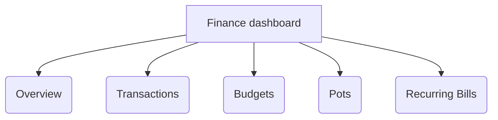
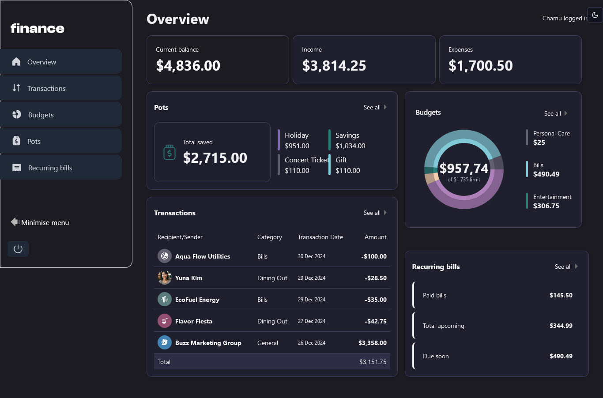
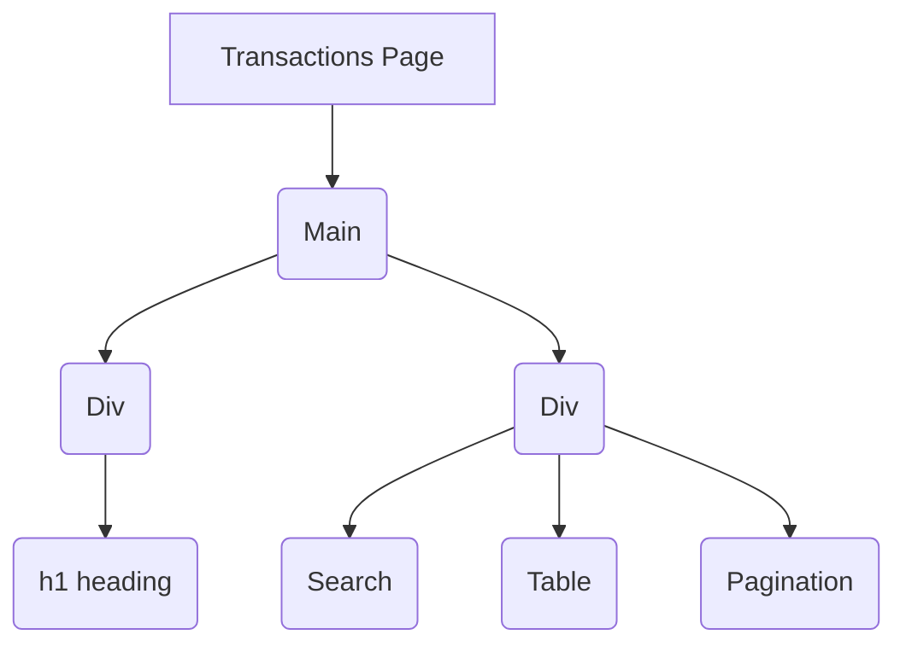

# Frontend Mentor - Personal finance app solution

This is a solution to the [Personal finance app challenge on Frontend Mentor](https://www.frontendmentor.io/challenges/personal-finance-app-JfjtZgyMt1). Frontend Mentor challenges help you improve your coding skills by building realistic projects.

## Table of contents

- [Overview](#overview)
  - [The challenge](#the-challenge)
  - [Roadmap strategy](#roadmap-strategy)
  - [Screenshot](#screenshot)
  - [Links](#links)
- [My process](#my-process)
  - [mermaid shortcut](#mermaid-shortcut)
  - [Built with](#built-with)
  - [What I learned](#what-i-learned)
  - [Continued development](#continued-development)
  - [Useful resources](#useful-resources)
- [Author](#author)
- [Acknowledgments](#acknowledgments)

## Overview

### The challenge

Users should be able to:

- See all of the personal finance app data at-a-glance on the overview page
- View all transactions on the transactions page with pagination for every ten transactions
- Search, sort, and filter transactions
- Create, read, update, delete (CRUD) budgets and saving pots
- View the latest three transactions for each budget category created
- View progress towards each pot
- Add money to and withdraw money from pots
- View recurring bills and the status of each for the current month
- Search and sort recurring bills
- Receive validation messages if required form fields aren't completed
- Navigate the whole app and perform all actions using only their keyboard
- View the optimal layout for the interface depending on their device's screen size
- See hover and focus states for all interactive elements on the page
- **Bonus**: Save details to a database (build the project as a full-stack app)
- **Bonus**: Create an account and log in (add user authentication to the full-stack app)

### Roadmap strategy

This is a five page project namely:

- Overview
  - The page display all the information at-a-glance and allow for easy navigation.
  - navigate to other pages from the dashboard.
- Transactions
  - Output the transactions from the database (vercel - postgres) and paginating results for every ten transactions.
  - Search using name  and category.
  - Sorting options using the powerful Tanstack Tables include: Latest (most recent), Oldest, A to Z, Z to A, Highest (transaction amount), Lowest.
  - The filter is by transaction category, which are: Entertainment, Bills, Groceries, Dining Out, Transportation, Personal Care, Education, Lifestyle, Shopping, General. Filtering by category should only show transactions from the selected category.
- Budgets
  - Donut pie chart to visually represent the budget categories.
  - The "Spent" amount should calculate the money spent within the category for the current month.
  - The "Latest Spending" component should display the three last transactions for that category regardless of the month.
  - Clicking "See All" on a budget should navigate to the Transactions page with the filter set to the relevant category. For example, clicking "See All" on Entertainment should only show transactions with the Entertainment category.
  - Adding a new budget should automatically pull in the three latest transactions from the created budget category and calculate the amount spent so far for August 2024.
  - Deleting a budget should remove it from the Budgets page and the Overview.
- Pots
  - Adding money to a pot should deduct the given amount from the current balance (seen on the Overview page).
  - Withdrawing money from a pot should add that amount to the current balance.
  - Deleting a pot should return all the money from the pot to the current balance.
- Recurring Bills
  - List out all the recurring transactions and ensure only one item is shown per vendor.
  - Show the recurring transactions that have already been paid for August 2024.
  - Show the payments due to be paid soon based on their monthly payment date. Calculate this from recurring transactions yet to be paid for August 2024, but due within five days of the latest overall transaction in the app (Emma Richardson - 19 August 2024).
  - The search should search based on name.
  - The sorting options include: Latest (earliest in the month), Oldest, A to Z, Z to A, Highest (transaction amount), Lowest.

Diagramatic Flow
to preview press ctrl + shift + v



### Screenshot



### Links

- Solution URL: [Add solution URL here](https://your-solution-url.com)
- Live Site URL: [Personal Finance Dashboard](https://personal-finance-dashboard-two.vercel.app/)

## My process

## Mermaid Shortcut

- to preview changes of mermaid in readme , press `ctrl + shift + v`

### Built with

- Semantic HTML5 markup
- CSS custom properties
- Flexbox
- CSS Grid
- Mobile-first workflow
- [React](https://reactjs.org/) - JS library
- [Next.js](https://nextjs.org/) - React framework
- [Styled Components](https://styled-components.com/) - For styles

### What I learned

#### Making a svg a react component

- Create a file in the src folder , for example create a file in the `src/component` folder and give the file the `.svg` extension
For example the `budget.svg`. Paste the svg code in that file

```tsx
<svg
            fill="none"
            height="20"
            viewBox="0 0 20 20"
            width="20"
            xmlns="http://www.w3.org/2000/svg"
        >
            <path
                d="m.32038 8.59187c.221475-1.85713.98107-3.60899 2.18531-5.04.13325-.16068.29856-.29177.48537-.38491.18681-.09313.391-.14625.59951-.15595.20851-.00971.41675.02421.61141.09958.19465.07538.37143.19055.51902.33816l2.59407 2.64937c.24982.24925.40292.57919.43194.93089.02902.35171-.06792.70228-.27351.98911-.15572.22092-.273.46656-.34687.72656-.02347.07671-.07091.14388-.13537.19164-.06446.04775-.14253.07357-.22276.07368h-6.074995c-.052937.00008-.105292-.01104-.153622-.03264s-.091539-.05319-.126785-.09268c-.035246-.0395-.06173-.08601-.077711-.13648s-.021095-.10374-.015007-.15633zm10.56002-8.57625c-.2072-.01806747-.4159.0071461-.6128.0740394-.1969.0668936-.37778.1740046-.53109.3145316-.15331.140528-.27573.3114-.35947.501766-.08374.190363-.12698.396063-.12697.604033v3.81282c-.00259.35379.12106.69691.34874.96772.22768.27082.54449.45156.89349.50978.6571.10841 1.2595.43241 1.7121.92093.4527.48852.73 1.11379.7881 1.77727.0581.66349-.1062 1.32739-.4671 1.88719-.3608.5598-.8977.9836-1.526 1.2046-.0731.0269-.1362.0755-.1808.1394s-.0685.1399-.0685.2178v6.1153c-.0004.0531.0105.1057.032.1542.0215.0486.0531.092.0926.1275.0395.0354.0861.0621.1367.0782s.104.0212.1568.0151c2.3399-.2889 4.4967-1.4131 6.0735-3.1658s2.4676-4.016 2.5084-6.37326c.0703-5.08968-3.826-9.431245-8.8697-9.88312zm-1.88815 12.57188c-.41923-.1495-.79993-.3905-1.1145-.7054-.31458-.3149-.55514-.6958-.70425-1.1152-.02556-.0744-.07354-.139-.13733-.185-.0638-.046-.14027-.0711-.21892-.0719h-6.124683c-.053006-.0003-.105481.0106-.153964.032s-.091873.0529-.127308.0923c-.035436.0394-.062111.0859-.078267.1364s-.021425.1038-.015461.1565c.262606 2.1669 1.244093 4.1833 2.787573 5.7268s3.55984 2.525 5.7268 2.7876c.05267.0059.10601.0007.15649-.0155.05049-.0162.09697-.0428.1364-.0783.03942-.0354.07088-.0788.0923-.1273.02143-.0485.03233-.1009.032-.1539v-6.1191c.00015-.0793-.02454-.1567-.07061-.2213-.04608-.0645-.11121-.113-.18627-.1387z"
                fill="currentColor"
            />
  </svg>
  ```

- install `npm install @svgr/webpack --save-dev`, the @svgr/webpack loader to transform SVGs into React components.
- Set up a custom webpack configuration in next.config.js to handle SVG imports:

```tsx
const nextConfig = {
  webpack(config) {
    config.module.rules.push({
      test: /\.svg$/,
      use: ["@svgr/webpack"]
    });

    return config;
  }
};

export default nextConfig;
```

check the `NavLinks.tsx` file for import and implementation

#### Creating a Postgres database on Vercel

- first , connect and deploy your project on Vercel
- when the project is successfully deployed on Vercel , do the following:
  - click `Continue to Dashboard` and select the `Storage` tab from the project dashboard.
  - select `Connect Store` => `Create New` => `Postgres` => `Continue`
  - accept the terms, assign a name to your database and ensure your database region is set to `Washington D.C (iasd1)` - this is the default region.
  - once connected , navigate to the `.env.local` tab , click `Show secret` and `Copy Snippet` . Make sure you reveal secrets before copying them
  - Navigate to your code editor and rename the .env.example file to .env. Paste in the copied contents from Vercel.
  - Important: Go to your `.gitignore` file and make sure `.env` is in the ignored files to prevent your database secrets from being exposed when you push to GitHub.
  - Finally, run `pnpm i @vercel/postgres` in your terminal to install the [Vercel Postgres SDK](https://vercel.com/docs/storage/vercel-postgres/sdk)

#### Seed your database

- when the database has been created , seed the database with some initial data
- inside of the `/app` folder create a folder called `seed` and inside this folder create a `route.ts` file and paste the following code that will be used to seed the database. This creates a server-side endpoint that you can access in the browser to start populating your database.
- the script uses SQL to create the tables, and the data from `placeholder-data.ts` file to populate them after they've been created.
- Ensure your local development server is running with `npm run dev` and navigate to `localhost:3000/seed` in your browser. When finished, you will see a message `Database seeded successfully` in the browser. Once completed, you can delete this file.

```ts
import bcrypt from "bcrypt";
import { db } from "@vercel/postgres";
import {
    transactions,
    balances,
    budgets,
    pots,
    users,
} from "../lib/placeholder-data";

const client = await db.connect();

async function seedUsers() {
    await client.sql`CREATE EXTENSION IF NOT EXISTS "uuid-ossp"`;
    await client.sql`
    CREATE TABLE IF NOT EXISTS users (
      id UUID DEFAULT uuid_generate_v4() PRIMARY KEY,
      name VARCHAR(255) NOT NULL,
      email TEXT NOT NULL UNIQUE,
      password TEXT NOT NULL
    );
  `;

    const insertedUsers = await Promise.all(
        users.map(async (user) => {
            const hashedPassword = await bcrypt.hash(user.password, 10);
            return client.sql`
        INSERT INTO users (id, name, email, password)
        VALUES (${user.id}, ${user.name}, ${user.email}, ${hashedPassword})
        ON CONFLICT (id) DO NOTHING;
      `;
        })
    );

    return insertedUsers;
}

async function seedBalances() {
    await client.sql`CREATE EXTENSION IF NOT EXISTS "uuid-ossp"`;
    await client.sql`
        CREATE TABLE IF NOT EXISTS balances (         
         current NUMERIC(10, 2) NOT NULL,
         income NUMERIC(10, 2) NOT NULL,
         expenses NUMERIC(10, 2) NOT NULL
        );
        `;

    const insertedBalances = await Promise.all(
        balances.map(
            async (balance) => client.sql`
    INSERT INTO balances ( current, income, expenses)
    VALUES (${balance.current}, ${balance.income}, ${balance.expenses})       
     `
        )
    );
    return insertedBalances;
}

async function seedTransactions() {
    await client.sql`CREATE EXTENSION IF NOT EXISTS "uuid-ossp"`;
    await client.sql`
    CREATE TABLE IF NOT EXISTS transactions (
      id UUID DEFAULT uuid_generate_v4() PRIMARY KEY,    
      avatar VARCHAR(255) NOT NULL,
      name VARCHAR(255) NOT NULL,
      category VARCHAR(255) NOT NULL,
      date DATE NOT NULL,
      amount NUMERIC(10, 2) NOT NULL,    
      recurring BOOLEAN NOT NULL
    );
  `;

    const insertedTransactions = await Promise.all(
        transactions.map(
            async (transaction) => client.sql`
        INSERT INTO transactions (id, avatar, name, category, date, amount, recurring)
        VALUES (${transaction.id}, ${transaction.avatar}, ${transaction.name}, ${transaction.category}, ${transaction.date}, ${transaction.amount}, ${transaction.recurring})
        ON CONFLICT (id) DO NOTHING;
      `
        )
    );

    return insertedTransactions;
}

async function seedBudgets() {
    await client.sql`CREATE EXTENSION IF NOT EXISTS "uuid-ossp"`;

    await client.sql`
    CREATE TABLE IF NOT EXISTS budgets (
      id UUID DEFAULT uuid_generate_v4() PRIMARY KEY,
      category VARCHAR(255) NOT NULL,
      maximum NUMERIC(10, 2) NOT NULL,
      theme VARCHAR(255) NOT NULL
    );
  `;

    const insertedBudgets = await Promise.all(
        budgets.map(
            async (budget) => client.sql`
        INSERT INTO budgets (id, category, maximum, theme)
        VALUES (${budget.id}, ${budget.category}, ${budget.maximum}, ${budget.theme})
        ON CONFLICT (id) DO NOTHING;
      `
        )
    );

    return insertedBudgets;
}

async function seedPots() {
    await client.sql`CREATE EXTENSION IF NOT EXISTS "uuid-ossp"`;
    await client.sql`
    CREATE TABLE IF NOT EXISTS pots (
      id UUID DEFAULT uuid_generate_v4() PRIMARY KEY,
      name VARCHAR(255) NOT NULL,
      target INT NOT NULL,
      total INT NOT NULL,
      theme VARCHAR(255) NOT NULL
    );
  `;

    const insertedPots = await Promise.all(
        pots.map(
            async (pot) => client.sql`
        INSERT INTO pots (id, name, target, total, theme)
        VALUES (${pot.id}, ${pot.name}, ${pot.target}, ${pot.total}, ${pot.theme})
        ON CONFLICT (id) DO NOTHING;
      `
        )
    );

    return insertedPots;
}

export async function GET() {  
    
    try {
        await client.sql`BEGIN`;
        await seedUsers();
        await seedBalances();
        await seedTransactions();
        await seedBudgets();
        await seedPots();
        await client.sql`COMMIT`;
        return Response.json({ message: "Database seeded successfully" });
    } catch (error) {
        await client.sql`ROLLBACK`;
        return Response.json({ error }, { status: 500 });
    }
        
}
```

#### The Budget page

#### The Transactions Page



- The Transaction page has data displayed in tabular for, this was achieved through the use of Shadcn and the Tanstack Table. The combination of the 2 offers some out of the box pagination , sorting and many more

### Continued development

### Useful resources

- [Tables in NextJs Using shadcn/ui and TanStack Table](https://www.youtube.com/watch?v=kHfDLN9w1KQ&t=1144s). A tutorial by a YouTuber Hamed Bahran where he used NextJs. The table was created using [Shadcn - Data Table](https://ui.shadcn.com/docs/components/data-table) and the powerful [TanStack Table](https://tanstack.com/table/latest)
- [Next.js: Authentication (Best Practices for Server Components, Actions, Middleware - by Delba)](https://www.youtube.com/watch?v=N_sUsq_y10U)
- [Next.Js Shadcn - Dark mode](https://ui.shadcn.com/docs/dark-mode/next)
- [Codefinity - nextjs authentication](https://codefinity.com/courses/v2/383258e5-c318-41bc-b29c-0495ff30ccbe/70678d9f-6131-4f11-b464-e6c859dbed27/dec25b72-99c2-4ff1-9105-aceffd559d94)

## Author

- Website - [Add your name here](https://www.your-site.com)
- Frontend Mentor - [@yourusername](https://www.frontendmentor.io/profile/yourusername)
- Twitter - [@yourusername](https://www.twitter.com/yourusername)

## Acknowledgments

This is where you can give a hat tip to anyone who helped you out on this project. Perhaps you worked in a team or got some inspiration from someone else's solution. This is the perfect place to give them some credit.
