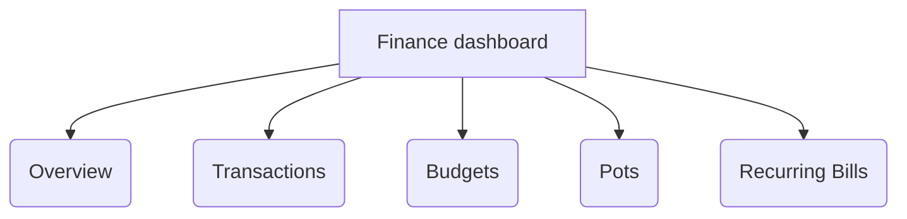

# Frontend Mentor - Personal finance app solution

This is a solution to the [Personal finance app challenge on Frontend Mentor](https://www.frontendmentor.io/challenges/personal-finance-app-JfjtZgyMt1). Frontend Mentor challenges help you improve your coding skills by building realistic projects.

## Table of contents

- [Overview](#overview)
  - [The challenge](#the-challenge)
  - [Roadmap strategy](#roadmap-strategy)
  - [Screenshot](#screenshot)
  - [Links](#links)
- [My process](#my-process)
  - [Built with](#built-with)
  - [What I learned](#what-i-learned)
  - [Continued development](#continued-development)
  - [Useful resources](#useful-resources)
- [Author](#author)
- [Acknowledgments](#acknowledgments)

## Overview

### The challenge

Users should be able to:

- See all of the personal finance app data at-a-glance on the overview page
- View all transactions on the transactions page with pagination for every ten transactions
- Search, sort, and filter transactions
- Create, read, update, delete (CRUD) budgets and saving pots
- View the latest three transactions for each budget category created
- View progress towards each pot
- Add money to and withdraw money from pots
- View recurring bills and the status of each for the current month
- Search and sort recurring bills
- Receive validation messages if required form fields aren't completed
- Navigate the whole app and perform all actions using only their keyboard
- View the optimal layout for the interface depending on their device's screen size
- See hover and focus states for all interactive elements on the page
- **Bonus**: Save details to a database (build the project as a full-stack app)
- **Bonus**: Create an account and log in (add user authentication to the full-stack app)

### Roadmap strategy

This is a five page project namely:

- Overview
  - This page should display all the information at-a-glance and allow for easy navigation.
  - We recommend building this page last, as it will require logic from the other pages (e.g., recurring bills) in order to display the data correctly.
- Transactions
  - Output the transactions from the `data.json` file, paginating results for every ten transactions.
  - The search should allow for name search, but feel free to add other functionality like searching for transaction amounts if you want to test yourself.
  - The sorting options include: Latest (most recent), Oldest, A to Z, Z to A, Highest (transaction amount), Lowest.
  - The filter is by transaction category, which are: Entertainment, Bills, Groceries, Dining Out, Transportation, Personal Care, Education, Lifestyle, Shopping, General. Filtering by category should only show transactions from the selected category.
- Budgets
  - Don't worry if you can't create a donut pie chart exactly like in the design. Do your best to get close, but feel free to go in your own direction.
  - The "Spent" amount should calculate the money spent within the category for the current month (August 2024 in the app).
  - The "Latest Spending" component should display the three last transactions for that category regardless of the month.
  - Clicking "See All" on a budget should navigate to the Transactions page with the filter set to the relevant category. For example, clicking "See All" on Entertainment should only show transactions with the Entertainment category.
  - Adding a new budget should automatically pull in the three latest transactions from the created budget category and calculate the amount spent so far for August 2024.
  - Deleting a budget should remove it from the Budgets page and the Overview.
- Pots
  - Adding money to a pot should deduct the given amount from the current balance (seen on the Overview page).
  - Withdrawing money from a pot should add that amount to the current balance.
  - Deleting a pot should return all the money from the pot to the current balance.
- Recurring Bills
  - List out all the recurring transactions and ensure only one item is shown per vendor.
  - Show the recurring transactions that have already been paid for August 2024.
  - Show the payments due to be paid soon based on their monthly payment date. Calculate this from recurring transactions yet to be paid for August 2024, but due within five days of the latest overall transaction in the app (Emma Richardson - 19 August 2024).
  - The search should search based on name.
  - The sorting options include: Latest (earliest in the month), Oldest, A to Z, Z to A, Highest (transaction amount), Lowest.

Diagramatic Flow
to preview press ctrl + shift + v


```mermaid
  graph TD
    A[Finance dashboard] --> B(Overview)
    A --> C(Transactions)
    A --> D(Budgets)
    A --> E(Pots)
    A --> F(Recurring Bills)
   

```

### Screenshot


Add a screenshot of your solution. The easiest way to do this is to use Firefox to view your project, right-click the page and select "Take a Screenshot". You can choose either a full-height screenshot or a cropped one based on how long the page is. If it's very long, it might be best to crop it.

Alternatively, you can use a tool like [FireShot](https://getfireshot.com/) to take the screenshot. FireShot has a free option, so you don't need to purchase it.

Then crop/optimize/edit your image however you like, add it to your project, and update the file path in the image above.

**Note: Delete this note and the paragraphs above when you add your screenshot. If you prefer not to add a screenshot, feel free to remove this entire section.**

### Links

- Solution URL: [Add solution URL here](https://your-solution-url.com)
- Live Site URL: [Personal Finance Dashboard](https://personal-finance-dashboard-two.vercel.app/)

## My process

### Built with

- Semantic HTML5 markup
- CSS custom properties
- Flexbox
- CSS Grid
- Mobile-first workflow
- [React](https://reactjs.org/) - JS library
- [Next.js](https://nextjs.org/) - React framework
- [Styled Components](https://styled-components.com/) - For styles

### What I learned

Use this section to recap over some of your major learnings while working through this project. Writing these out and providing code samples of areas you want to highlight is a great way to reinforce your own knowledge.

To see how you can add code snippets, see below:

```html
<h1>Some HTML code I'm proud of</h1>
```

```css
.proud-of-this-css {
  color: papayawhip;
}
```

```js
const proudOfThisFunc = () => {
  console.log('🎉')
}
```

If you want more help with writing markdown, we'd recommend checking out [The Markdown Guide](https://www.markdownguide.org/) to learn more.

**Note: Delete this note and the content within this section and replace with your own learnings.**

### Continued development

Use this section to outline areas that you want to continue focusing on in future projects. These could be concepts you're still not completely comfortable with or techniques you found useful that you want to refine and perfect.

**Note: Delete this note and the content within this section and replace with your own plans for continued development.**

### Useful resources

- [Example resource 1](https://www.example.com) - This helped me for XYZ reason. I really liked this pattern and will use it going forward.
- [Example resource 2](https://www.example.com) - This is an amazing article which helped me finally understand XYZ. I'd recommend it to anyone still learning this concept.

**Note: Delete this note and replace the list above with resources that helped you during the challenge. These could come in handy for anyone viewing your solution or for yourself when you look back on this project in the future.**

## Author

- Website - [Add your name here](https://www.your-site.com)
- Frontend Mentor - [@yourusername](https://www.frontendmentor.io/profile/yourusername)
- Twitter - [@yourusername](https://www.twitter.com/yourusername)

**Note: Delete this note and add/remove/edit lines above based on what links you'd like to share.**

## Acknowledgments

This is where you can give a hat tip to anyone who helped you out on this project. Perhaps you worked in a team or got some inspiration from someone else's solution. This is the perfect place to give them some credit.

**Note: Delete this note and edit this section's content as necessary. If you completed this challenge by yourself, feel free to delete this section entirely.**
